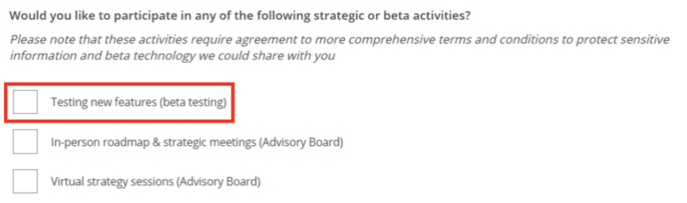

# Data Repair API Beta

> NOTE: This page contains beta documentation that is subject to change before the final product release. 

The Data Repair API provides you with a mechanism to delete or edit certain existing Adobe Analytics data.
repair requests are made by submitting a job definition to the Data Repair API, which includes
the report suite, date range, variables and actions to be applied to the data. 

The Data Repair API Beta currently supports the following actions:

* Deleting Activity Map data

The Data Repair API returns:
* The Server Call volume estimate for the data repair job
* The job id
* The status of a submitted job id
* A list of all data repair jobs for a report suite

> WARNING: Use of the Data Repair API permanently deletes existing Adobe Analytics data.
> We recommend a careful approach to executing the repair to minimize accidental deletion.
> Read through this document before using the Data Repair API.

## Data Repair API Beta Requirements

To begin using the Data Repair API, there are five requirements:

#### 1. Sign the Beta Agreement
Through the Experience Cloud Beta Panel system, we have provided a simple form and agreement:

https://experiencecloudpanel.adobe.com/c/r/datarepair

When completing the form, please be sure to check the box “Testing new features (beta testing)” in the participation question. This indicates your willingness to participate in the beta.



#### 2. Request access to the API

You can request free access to the Data Repair API Beta through a customer support ticket.  
Please reference your global company id or login company in the ticket.
Only one access request is needed for your log-in company.  Please be sure to use the same name, e-mail address,
and company you used in your completed Beta Panel form. Check with customer support on your company’s status.

During the public beta, we will be sending surveys on the performance of the Data Repair API
and request your feedback on the product.  

After the public beta period ends, any continued use or access to the Data Repair API will require a SKU entitlement
(via an executed Sales Order) and include usage fees.

#### 3.	Create a Service Account Connection within Adobe I/O

A Service Account Connection allows the Data Repair API to call Adobe services.  For information on how to set up the
connection, follow the instructions described in the
[Service Account Connection](https://github.com/AdobeDocs/adobeio-auth/blob/stage/AuthenticationOverview/ServiceAccountIntegration.md)
documentation.   You can configure the Connection with access to the Adobe Analytics APIs.  During the process, you
will generate a key pair and download the private key.  Store the API Key / Client ID associated with the Service
Account Connection securely.  This is used when accessing the Data Repair API.

#### 4. Grant the Data Repair API permission to the new Service Account Connection in the Experience Cloud

Adobe Experience Cloud Admin Console includes product profile controls. Product profiles have Adobe Analytics-specific
User permissions for managing integration access to reporting features and data.

The Data Repair API permission is located under the Adobe Analytics Report Suite Tools permission group.


 
For more information on creating profiles and managing permissions, see
[Manage Products and Profiles](https://helpx.adobe.com/enterprise/using/manage-products-and-profiles.html) and
[Manage Permissions and Roles](https://helpx.adobe.com/enterprise/using/manage-permissions-and-roles.html).
 
#### 5.	Create a JSON Web Token

In order to establish a secure service-to-service Adobe I/O API session, create a JSON Web Token (JWT) that
encapsulates the identity of the product integration, and then exchange it for an access token. Every request to an
Adobe service must include the access token in the `Authorization header`, along with the `API Key / Client ID`
associated with the Service Account Connection.  For more information about creating a JWT access token, see
[JWT Authentication](https://github.com/AdobeDocs/adobeio-auth/blob/stage/JWT/JWT.md).  For instructions on testing your JWT, see Step 3 in the 
[Service Account Connection](https://github.com/AdobeDocs/adobeio-auth/blob/stage/AuthenticationOverview/ServiceAccountIntegration.md#step-3-try-it)
documentation.

> NOTE: A new access token must be created before each use of the Data Repair API.

## Submit a data repair job

To submit a data repair job, there are three steps:

#### 1. Estimate repair size

After the close of the public beta, the Data Repair API will incur charges based on usage. The Data Repair API scans
every row of data looking for repairs.   Sizing is based on rows scanned.  The `/serverCallEstimate` endpoint is a
required step to help you estimate the cost of a repair .  The `/serverCallEstimate` endpoint returns a count of the
Server Call volume for the report suite date range. The endpoint also returns a `validationToken`, which is required
for the job creation call.

#### 2. Create repair

To create a data repair job, use the `/job` endpoint. This endpoint requires a Report Suite, date range,
`validationToken` (from `/serverCallEstimate`), and a job definition, which specifies the variables to be repaired.  

#### 3. Monitor progress

When a repair job is created, a Job ID will be returned. The `/job/{JOB_ID}` endpoint can be used to monitor the status
of a job at any point after job submission.

Completion of a repair job may take hours to days.

## Server Call Estimate

The /serverCallEstimate endpoint calculates the number of Server Calls for the given Report Suite and date range
provided.  It also returns `validationToken`, which is will be passed to `/job` in the `validationToken` query string 
parameter. The Server Call volume can be multiplied by the CPMM rate found in the Data Repair API Sales Order. This
calculation provides an estimate of the cost of the data repair job. The date range is specified in days and is based
on the time zone of the Report Suite. The date range is inclusive of the start and end dates for estimates and repairs.

The `ANALYTICS_GLOBAL_COMPANY_ID` can be found in Adobe Analytics > Admin > Company Settings > API Access. 
Look for the bold text value in the second sentence.

#### Example Request
```bash
curl -X GET -H "accept: application/json" -H "x-proxy-global-company-id: {ANALYTICS_GLOBAL_COMPANY_ID}" \
    -H "Authorization: Bearer {ACCESS_TOKEN}" -H "x-api-key: {API_KEY/CLIENT_ID}" \
    "https://analytics.adobe.io/api/{ANALYTICS_GLOBAL_COMPANY_ID}/datarepair/v1/{REPORT_SUITE_ID}/serverCallEstimate?dateRangeStart={YYYY-MM-DD}&dateRangeEnd={YYYY-MM-DD}"
```

#### Example Response
```json
{
    "dateRangeEnd": "2019-03-28",
    "dateRangeStart": "2019-03-28",
    "reportSuiteId": "sample.reportsuite",
    "serverCallEstimate": 150000,
    "validationToken": "gAAAAABee777APCKafp7zDu-I3kFIEq_4AoeZSIap8wt0RhgNHmVdjnlrKCjPOo_PW74uj0qvDPG9B_SiYOe4p1Rg6Um1vCpL7dLwtkBX7i8wNheVPhb2j4nAapE-k6WPVcdP7FXNdjKvogMwHBEvGpAz6uO6TmpxwZUa3LMixaeN65BOFZW3i9ZnzZ400oCHte6XAX6Mo7QF-PyZZ6D--693K0cO_oUYg=="
}
```

## Job Creation

The `/job` endpoint creates the data repair job. A JSON-formatted Job Definition is passed in as the POST body and a
Job ID is returned. 

The `/job` endpoint uses the `validationToken` from the `/serverCallEstimate` endpoint to confirm that its parameters
are the same as those passed to `/serverCallEstimate`. If the parameters do not match or the Server Call volume has
changed significantly between the call to `/serverCallEstimate` and the call to `/job`, the Data Repair API will
return an error.

If the scope of the data repair job changes, re-run the `/serverCallEstimate` endpoint to generate a new
`validationToken`.

> WARNING: Use of the Data Repair API permanently deletes existing Adobe Analtyics data. Follow the recommended
> workflow for testing and validation prior to applying any data repair jobs to production data.

#### Job Definition

The job definition is used to specify the variables you want to repair and what actions to take on those variables.
The definition format follows this pattern:

```json
{
  "variables": {
    "{VARIABLE_1}": {
      "action": "{ACTION_1}"
    },
    "{VARIABLE_2}": {
      "action": "{ACTION_2}"
    }
  }
}
```

#### Activity Map

The Activity Map variable includes `clickmappage`, `clickmaplink`, `clickmapregion`, and `clickmaplinkbyregion` as well
as the context data used to populate these identities.

To delete Activity Map data, use the following job definition:

```json
{
  "variables": {
    "activitymap": {
      "action": "delete"
    }
  }
}
``` 

#### Example Request
```bash
curl -X POST -H "accept: application/json" -H "x-proxy-global-company-id: {ANALYTICS_GLOBAL_COMPANY_ID}" \
    -H "Authorization: Bearer {ACCESS_TOKEN}" -H "x-api-key: {API_KEY/CLIENT_ID}" -d '{REPAIR_JOB_DEFINITION}' \
    "https://analytics.adobe.io/api/{ANALYTICS_GLOBAL_COMPANY_ID}/datarepair/v1/{REPORT_SUITE_ID}/job?validationToken={VALIDATION_TOKEN}&dateRangeStart={YYYY-MM-DD}&dateRangeEnd={YYYY-MM-DD}"
```

#### Example Response
```json
{
    "dateRangeEnd": "2019-03-28",
    "dateRangeStart": "2019-03-28",
    "jobCompleteTime": null,
    "jobCreateTime": "2020-03-24T09:02:59+00:00",
    "jobDefinition": {
        "variables": {
            "activitymap": {
                "action": "delete"
            }
        }
    },
    "jobId": 24,
    "progress": 0,
    "reportSuiteId": "sample.reportsuite",
    "serverCalls": null,
    "status": "processing"
}

```

## Job Status

The `/job/{JOB_ID}` endpoint is called to check on the progress of a data repair job.  Following submission of a job,
`status` will report as `processing` and `progress` will be a number between `0` and `100`.  Once complete, `status`
will report as `complete` and `serverCalls` will be set to the actual number of Server Calls scanned during the data
repair job. This `serverCalls` value will be used to calculate usage.

Completion of a repair job may take hours to days.

#### Example Request
```bash
curl -X GET -H "accept: application/json" -H "x-proxy-global-company-id: {ANALYTICS_GLOBAL_COMPANY_ID}" \
    -H "Authorization: Bearer {ACCESS_TOKEN}" -H "x-api-key: {API_KEY/CLIENT_ID}" \
    "https://analytics.adobe.io/api/{ANALYTICS_GLOBAL_COMPANY_ID}/datarepair/v1/{REPORT_SUITE_ID}/job/{JOB_ID}"
```

#### Example Response
```json
{
    "dateRangeEnd": "2019-03-28",
    "dateRangeStart": "2019-03-28",
    "jobCompleteTime": "2020-03-24T10:13:51+00:00",
    "jobCreateTime": "2020-03-24T09:02:59+00:00",
    "jobDefinition": {
        "variables": {
            "activitymap": {
                "action": "delete"
            }
        }
    },
    "jobId": "24",
    "progress": 100,
    "reportSuiteId": "sample.reportsuite",
    "serverCalls": 2,
    "status": "complete"
}
```

## Job List

The `/job` endpoint lists all data repair jobs that have been created for the given report suite.

#### Example Request
```bash
curl -X GET -H "accept: application/json" -H "x-proxy-global-company-id: {ANALYTICS_GLOBAL_COMPANY_ID}" \
    -H "Authorization: Bearer {ACCESS_TOKEN}" -H "x-api-key: {API_KEY/CLIENT_ID}" \
    "https://analytics.adobe.io/api/{ANALYTICS_GLOBAL_COMPANY_ID}/datarepair/v1/{REPORT_SUITE_ID}/job"
```

#### Example Response
```json
[
    {
        "dateRangeEnd": "2019-03-28",
        "dateRangeStart": "2019-03-28",
        "jobCompleteTime": "2020-03-24T10:13:51+00:00",
        "jobCreateTime": "2020-03-24T09:02:59+00:00",
        "jobDefinition": {
            "variables": {
                "activitymap": {
                    "action": "delete"
                }
            }
        },
        "jobId": "24",
        "progress": 100,
        "reportSuiteId": "sample.reportsuite",
        "serverCalls": 2,
        "status": "complete"
    },
    {
        "dateRangeEnd": "2019-04-28",
        "dateRangeStart": "2019-04-28",
        "jobCompleteTime": null,
        "jobCreateTime": "2020-04-24T09:02:59+00:00",
        "jobDefinition": {
            "variables": {
                "activitymap": {
                    "action": "delete"
                }
            }
        },
        "jobId": "25",
        "progress": 0,
        "reportSuiteId": "sample.reportsuite",
        "serverCalls": 2,
        "status": "processing"
    }
]

```

## Recommended Workflow

The Data Repair API permanently deletes or edits existing data.  The following workflow provides multiple checkpoints
to minimize the risk of accidental data deletion.  Review the data after each step to confirm the data repair job
completes as expected.
 
Create a repair job in the following:
1. A __development__ Report Suite for __one day__ of data.
2. A __development__ Report Suite for __one month__ of data.
3. A __production__ Report Suite for __one day__ of data.
4. A __production__ Report Suite for __one month__ of data.
5. Once all testing and validation is complete, then proceed with the __full date range__ of the data repair
   for __production__ data.