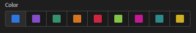

# Annotations API

The Analytics 2.0 Annotations APIs allow you to retrieve, update, or create annotations programmatically through Adobe I/O. These APIs use the same data and methods that Adobe uses inside the product UI.

## Retrieve multiple annotations

Retrieve a list of annotations that the user can access.

`GET https://analytics.adobe.io/api/{GLOBALCOMPANYID}/annotations`

For example, get a response of all annotations shared with the user.

<CodeBlock slots="heading, code" repeat="2" languages="CURL,JSON"/>

#### Request

```sh
curl -X GET "https://analytics.adobe.io/api/exampleco/annotations?includeType=shared" \
    -H "x-api-key: {CLIENTID}" \
    -H "x-proxy-global-company-id: exampleco" \
    -H "Authorization: Bearer {ACCESSTOKEN}" \
```

#### Response

```json
{
    "content": [
        {
            "id": "62437d"
        }
    ],
    "totalElements": 1,
    "totalPages": 1,
    "numberOfElements": 1,
    "number": 0,
    "firstPage": true,
    "lastPage": true,
    "sort": null,
    "size": 10
}
```

## Retrieve a single annotation

You can retrieve details around a single annotation if you know the annotation ID. You can find the annotation ID by using the multiple annotations endpoint. See [Annotation parameters](parameters.md) for query strings that you can attach to this API call.

`GET https://analytics.adobe.io/api/{GLOBALCOMPANYID}/annotations/{ID}`

For example, find details around the annotation with an ID of `62437d`, including the name, description, date range, and color:

<CodeBlock slots="heading, code" repeat="2" languages="CURL,JSON"/>

#### Request

```sh
curl -X GET "https://analytics.adobe.io/api/exampleco/annotations/62437d?expansion=name,description,dateRange,color" \
    -H "x-api-key: {CLIENTID}" \
    -H "x-proxy-global-company-id: exampleco" \
    -H "Authorization: Bearer {ACCESSTOKEN}"
```

#### Response

```json
{
    "id": "62437d",
    "name": "Example annotation",
    "description": "This is an example annotation description.",
    "dateRange": "YYYY-03-29T00:00:00/YYYY-03-29T23:59:59",
    "color": "STANDARD6"
}
```

## Create an annotation

You can create annotations using `POST` API calls. The following fields are required within a JSON body attached to the API call:

* **`name`**: The name of the annotation.
* **`rsid`**: The report suite ID for the annotation.
* **`dateRange`**: The date range of the annotation. Use two date ranges separated by a forward slash (`/`) in ISO 8601 format, based on the report suite's time zone.
* **`color`**: The annotation's color. Supported values include `STANDARD1` through `STANDARD9`, representing each of the available colors in the UI.



See [Annotation definition data structure](definition.md) for a full reference of available fields.

`POST https://analytics.adobe.io/api/{GLOBALCOMPANYID}/annotations`

For example, create a basic annotation with the minimum required fields. The API responds with the automatically generated annotation ID.

<CodeBlock slots="heading, code" repeat="2" languages="CURL,JSON"/>

#### Request

```sh
curl -X POST "https://analytics.adobe.io/api/exampleco/annotations" \
    -H "x-api-key: {CLIENTID}" \
    -H "x-proxy-global-company-id: exampleco" \
    -H "Authorization: Bearer {ACCESSTOKEN}" \
    -H "Content-Type: application/json" \
    -d "{'name': 'Example annotation',
        'rsid': 'examplersid',
        'dateRange': YYYY-02-14T00:00:00/YYYY-02-14T23:59:59',
        'color': 'STANDARD1'}"
```

#### Response

```json
{
    "id": "62439328"
}
```

## Delete an annotation

When you delete an annotation, it is hidden from all users in all menus. It is also hidden from API calls to the multiple annotations endpoint. You can still retrieve details on a deleted annotation if you have the annotation ID.

`DELETE https://analytics.adobe.io/api/{GLOBALCOMPANYID}/annotations/{ID}`

For example, delete an annotation with the ID of `62437d`:

<CodeBlock slots="heading, code" repeat="2" languages="CURL,JSON"/>

#### Request

```sh
curl -X DELETE "https://analytics.adobe.io/api/exampleco/annotations/62437d" \
    -H "x-api-key: {CLIENTID}" \
    -H "x-proxy-global-company-id: exampleco" \
    -H "Authorization: Bearer {ACCESSTOKEN}" \
```

#### Response

```json
{
  "result": "success"
}
```

## Update an annotation

You can edit annotations using `PUT` API calls. It supports partial updates, meaning that instead of sending an entire annotation JSON object, you can only send the fields that you want to update. This API call requires a JSON body, which determines the parts of an annotation that you want to update.

`PUT https://analytics.adobe.io/api/{GLOBALCOMPANYID}/annotations/{ID}`

See [Annotation definition data structure](definition.md) for a full reference of available fields.

For example, only update the name of the annotation with an ID of `62437d`:

<CodeBlock slots="heading, code" repeat="2" languages="CURL,JSON"/>

#### Request

```sh
curl -X PUT "https://analytics.adobe.io/api/exampleco/annotations/62437d" \
    -H "x-api-key: {CLIENTID}" \
    -H "x-proxy-global-company-id: exampleco" \
    -H "Authorization: Bearer {ACCESSTOKEN}" \
    -H "Content-Type: application/json" \
    -d "{'name':'Different annotation name'}"
```

#### Response

```json
{
    "id": "62437d"
}
```
