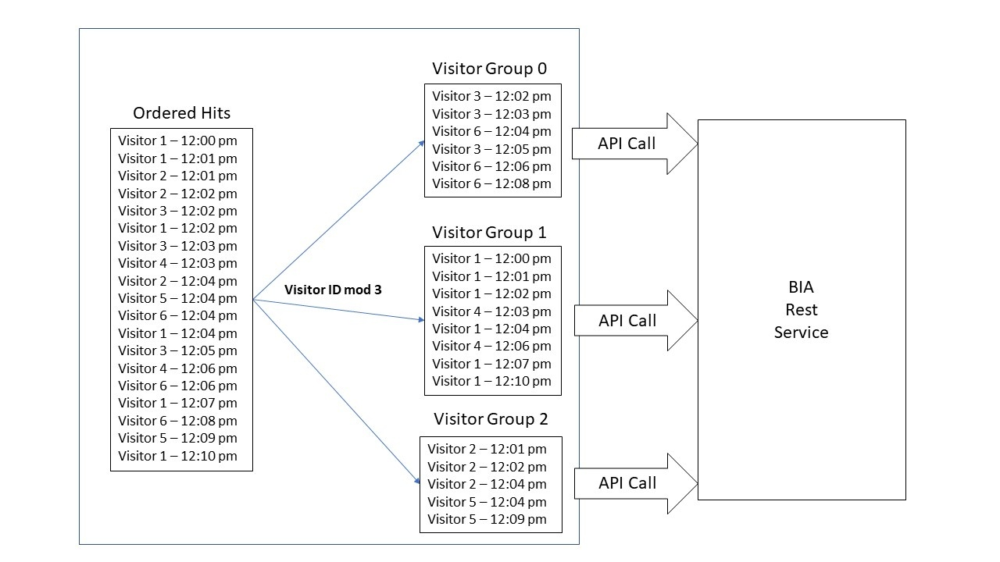

# Visitor groups

Visitor groups allow customers to upload files that can be processed in parallel, thus increasing the overall ingestion throughput. Each file uploaded must be tagged with a visitor group via an HTTP header. There are important rules that must be followed when categorizing batch files into visitor groups.

A visitor group is a set of visitor IDs that are disjoint from any other visitor group set. This affects which server calls can be batched into which files. Because each file belongs to a single visitor group, two files that belong to different visitor groups must always have separate visitor IDs in them--there can be no overlap between visitor IDs across groups.

For example, if a customer has decided to divide their integer visitor IDs into two visitor groups, group A might contain all odd visitor IDs and group B might contain all even visitor IDs. The method of categorizing them isn’t important as long as a visitor ID in group A will not appear in any of the files uploaded with a group B visitor group tag.

Customers can split up their visitor IDs, and therefore files, into any number of visitor groups to increase parallelism and throughput (up to their set throttle limit). The same batch file requirements regarding size, ordering of the timestamps in the files, and the order in which files are uploaded, still apply for each visitor group.

Another way to think of visitor groups is to view them as separate processing pipelines. Each visitor group creates a separate processing pipeline for files associated with that visitor group. Each pipeline processes files concurrently with other processing pipelines.

## Additional Visitor Group Example

Suppose a set of server calls has integer visitor IDs, 1-100, and we want to create three disjoint visitor group sets. We can use the mathematical MOD operation to organize these visitors into 3 groups. Server calls where `visitor ID MOD 3 = 0` go into visitor group `0`. Server calls where `visitor ID MOD 3 = 1` go into visitor group `1`, and so forth. Server calls are batched into files and ordered by timestamp, per their visitor group, and are then uploaded with that visitor group specified in the header of the API request. Since the visitors in these files are all disjoint, the BDIA system can process them in parallel without risking any calls for a visit being processed out of order.

## Naming visitor groups

For optimal ingestion efficiency, we request that your visitor group ID names incorporate a string related to your company or report suite. In the past many companies have used simple sequential integers for their visitor group names (i.e. 0,1,2,3, etc), resulting in many visitor groups of the same name across clients. Instead, please append a string to your group name, such as mycompany_1, or myreportsuite_1. We do not enforce unique visitor id group names across clients, but doing so will improve the processing latency of your files.

## Changing Visitor Groups

Customers may wish to change how they divide their visitor IDs into groups over time. This is possible as long as all files using previously named visitor groups completely finish ingestion before files with new visitor group assignments are uploaded. This ensures that there will be no visitor ID overlap between the new groups and old groups.

## Uploading Files in Order

Internally, files have a requirement for timestamp order. Multiple files have the same restriction. For example, if server calls for Visitor A exist over a long period of time, they may be present in multiple batch files. This is supported but the files must be uploaded in chronological order such that server calls for Visitor A are uploaded, even across files, in order. In other words, the server calls for a visitor in a file must not only be sorted chronologically, but the files must also be uploaded chronologically per their server call contents.

When uploading a file via the REST API, it is important to understand that the files will be processed in the order they are received (per visitor group). If you try to upload two files at once for the same visitor group, whichever REST call receives a “200 OK” first will be processed by the system first. Because of possible race conditions, it is important to upload files within a visitor group one at a time, waiting for a “200 OK” from the server that a file has been successfully uploaded before uploading another.

## Number of Visitor Groups, File Size and Send Frequency Recommendations

Bulk Insertion was designed to run optimally with larger file sizes. We recommend a pattern of larger files uploaded less frequently rather than small files uploaded more frequently.

For an implementation guideline, we offer the following recommendations:

* Ingestion rate of 2000 rows per second per visitor group
* No more than 1 API call per 20 seconds per visitor group
* No more than (peak events/second)\1000 total visitor groups

## How many visitor groups to use

Using these guidelines, you can approximate how many visitor groups to utilize. For example, suppose your company anticipates submitting 1 billion rows per day. At a rate of 2000 rows per second, a single visitor group could support ~173 million rows per 24 hours. Dividing 1 billion (anticipated rows) by 173 million (maximum rows for one visitor group) yields 5.7. In this example, an implementation of at least 6 visitor groups would be appropriate.

The API also caps the maximum number of visitor groups you can use.  Using the example above with 1 billion rows per day, that's an average of 11,574 rows per second. Most usage patterns do not evenly flow throughout the day, so suppose your site's peak traffic gets up to 30,000 events per second.  Dividing that number by 1000 yields a maximum of 30 visitor groups. In this example, visitor groups between 6 and 30 would be acceptable.

## How big to make files

Continuing the above example, if you used 15 visitor groups, that would result in ~67 million rows per day/per group, or 775 rows per second. As far as send frequency, you could choose to send a file of ~16,000 rows every 20 seconds, or ~23,000 rows every 30 seconds, and so forth.

File size varies according to the average size of each row. While BDIA is optimized for larger files sent less frequently, the API can only handle compressed files of up to 100 MB. However, files of this size are usually only utilized for historical ingest scenarios. Existing clients tend to send files with rows between 5,000 and 50,000 rows, and sizes of 500k up to 20 MB.
