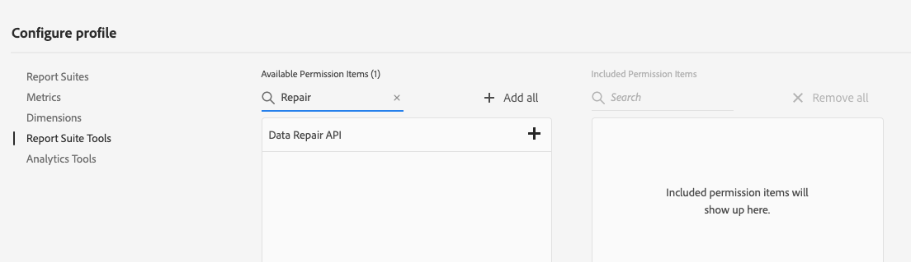

# Data Repair API

The Data Repair API provides you with a way to delete or edit Adobe Analytics data.  Repair requests are made by submitting a job definition to the Data Repair API, which includes the report suite, date range, variables and actions to be applied to the data.

The Data Repair API supports the following:
* Variables: eVars, props, activity map, campaign, site section, page, entry page, geography, and page events.  [See full list of variables to act on.](#variables)
* Actions: delete, set, deleteQueryString, and deleteQueryStringParameters.  [All actions to take on a given variable.](#actions)
* Filters: inList, isEmpty, isURL, isNotURL, contains, startsWith, and endsWith.  [More details on optional filters.](#filters)

The Data Repair API returns:
* The Server Call volume estimate for the data repair job
* The job id
* The status of a submitted job id
* A list of all data repair jobs for a report suite

> WARNING: Use of the Data Repair API permanently deletes existing Adobe Analytics data. Adobe recommends a careful approach to executing the repair to minimize accidental deletion. Read through all pages of this guide before using the Data Repair API.

## Getting Started

To begin using the Data Repair API, there are four requirements:

1. **Confirm contract**: The Data Repair API is a paid service. Reach out to your Adobe Account Manager for details and confirmation of your status.

#### 2.	Create a Service Account Connection within Adobe I/O

A Service Account Connection allows the Data Repair API to call Adobe services.  For information on how to set up the connection, follow the instructions described in the [Service Account Connection](https://github.com/AdobeDocs/adobeio-auth/blob/stage/AuthenticationOverview/ServiceAccountIntegration.md) documentation.   You can configure the Connection with access to the Adobe Analytics APIs.  During the process, you will generate a key pair and download the private key.  Store the API Key / Client ID associated with the Service Account Connection securely.  This is used when accessing the Data Repair API. 

See [Getting started](../../getting-started/index.md) for information around the correct permissions, creating an API client in the Adobe I/O Console, and successfully authenticating. Make sure that you include the "Data Repair API" permission item when creating a product profile.

#### 3. Grant the Data Repair API permission to the new Service Account Connection in the Experience Cloud

Adobe Experience Cloud Admin Console includes product profile controls. Product profiles have Adobe Analytics-specific User permissions for managing integration access to reporting features and data.

The Data Repair API permission is located under the Adobe Analytics Report Suite Tools permission group.

 
For more information on creating profiles and managing permissions, see [Manage Products and Profiles](https://helpx.adobe.com/enterprise/using/manage-products-and-profiles.html) and [Manage Permissions and Roles](https://helpx.adobe.com/enterprise/using/manage-permissions-and-roles.html).
 
#### 4.	Create a JSON Web Token

In order to establish a secure service-to-service Adobe I/O API session, create a JSON Web Token (JWT) that encapsulates the identity of the product integration, and then exchange it for an access token. Every request to an Adobe service must include the access token in the `Authorization header`, along with the `API Key / Client ID` associated with the Service Account Connection.  For more information about creating a JWT access token, see [JWT Authentication](https://github.com/AdobeDocs/adobeio-auth/blob/stage/JWT/JWT.md).  For instructions on testing your JWT, see Step 3 in the  [Service Account Connection](https://github.com/AdobeDocs/adobeio-auth/blob/stage/AuthenticationOverview/ServiceAccountIntegration.md#step-3-try-it) documentation.

> NOTE: A new access token must be created before each use of the Data Repair API.

## Submit a data repair job

To submit a data repair job, there are three steps:

#### 1. Estimate repair size

The Data Repair API incurs charges based on usage.  It scans every row of data looking for repairs, job sizing is based on rows scanned.  The `/serverCallEstimate` endpoint is a required step to help you estimate the cost of a repair. The `/serverCallEstimate` endpoint returns a count of the Server Call volume for the report suite date range. The endpoint also returns a `validationToken`, which is required for the job creation call.

#### 2. Create repair

To create a data repair job, use the `/job` endpoint. This endpoint requires a Report Suite, date range, `validationToken` (from `/serverCallEstimate`), and a job definition, which specifies the variables to be repaired.  A Job ID is returned when a repair job is created. 

#### 3. Monitor progress

Use the `/job/{JOB_ID}` endpoint to monitor the status of a job at any point after job submission.  Completion of a repair job may take hours to days.
