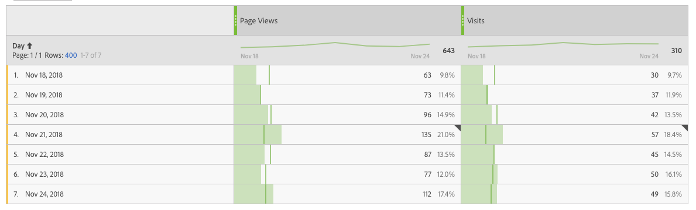
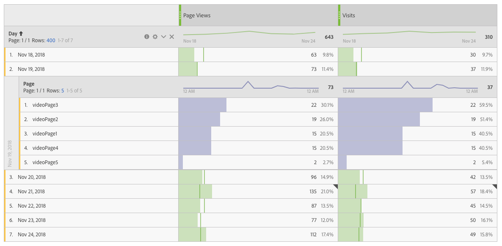
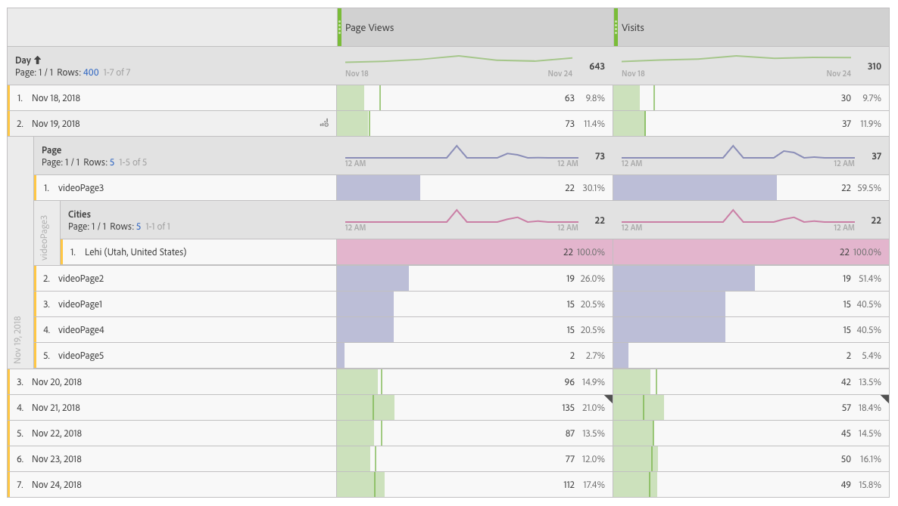

# Breakdowns

Breakdowns in the API are useful when you want to see the cross-product of values from two different dimensions. When requesting a breakdown report, use the `metricsFilters` and `dimension` parameters to request the additional dimension.

The following example requests a breakdown report containing a list of the top five "Internal Search Terms" used by visitors who saw campaign 10. Within the `metricsFilters` parameter, the type is set to `breakdown` (line 21), and `evar1` is the marketing campaign (line 22). Within the `dimensions` parameter, `evar2` is the "Internal Search Terms" (line 27).

**Note:** If the text value of item is already known, it can be passed inside the `metricFilter` object as `itemValue` field (Make sure to pass the exact text value). For example, instead of passing the item id `"itemId":"743855946"` of the item "Campaign 10", we can pass the text value of the item like this `"itemValue" : "10"` Passing an item value instead of item id will result in slightly slower performance, but it will be useful in preventing multiple reporting calls to retrieve item ids.

```json
{
   "rsid":"examplersid",
   "globalFilters":[
      {
         "type":"dateRange",
         "dateRange":"2017-12-31T00:00:00.000/2018-01-06T23:59:59.999"
      }
   ],
   "metricContainer":{
      "metrics":[
         {
            "columnId":"0",
            "id":"metrics/pageviews",
            "filters":[
               "0"
            ]
         }
      ],
      "metricFilters":[
         {
            "id":"0",
            "type":"breakdown",
            "dimension":"evar1",
            "itemId":"743855946"
         }
      ]
   },
   "dimension":"variables/evar2",
   "settings":{
      "dimensionSort":"asc",
      "limit":5
   }
}
```

## Response

The following example shows that the top search terms for Campaign 10 are "red t-shirt", "digital watches", "sport socks", "gps watch", and "running shoes."

```json
{
      "totalPages":2,
      "firstPage":true,
      "lastPage":false,
      "numberOfElements":5,
      "number":0,
      "totalElements":7,
      "columns":{
         "dimension":{
            "id":"variables/evar2",
            "type":"string"
         },
         "columnIds":[
            "0"
         ]
      },
      "rows":[
         {
            "itemId":"1132341824",
            "value":"red t-shirt",
            "data":[
               1515.0
            ]
         },
         {
            "itemId":"2400044733",
            "value":"digital watches",
            "data":[
               1.0
            ]
         },
         {
            "itemId":"3351316813",
            "value":"sport socks",
            "data":[
               11.0
            ]
         },
         {
            "itemId":"3440395251",
            "value":"gps watch",
            "data":[
               95.0
            ]
         },
         {
            "itemId":"3614317595",
            "value":"running shoes",
            "data":[
               16.0
            ]
         }
      ],
      "summaryData":{
         "totals":[
            2032.0
         ]
      }
   }
```

## Multi-level breakdowns

Multiple level breakdowns with the Reports API is helpful for visualizing the cross-product of values from three or more dimensions.

For example, if you create an interactive map to explore product sales by campaigns and regions, the Reports API can dynamically update the map as new data becomes available. This allows team members to select different map locations from which they can view the current campaigns and product sales for the region.

In the following example, these levels are used:

1. Top level: Visualize the `Day` dimension filtered by the `Page Views` and `Visits` metrics.
1. Second level: Visualize the previous level of data after a specifying a `Date` and applying the `Page` dimension.
1. Third level: Visualize the previous two levels of data after applying the `Cities` dimension to a specified page.

For each level of the breakdown report below, a sample JSON request and response is provided.

### Top level report

The top level report in the following example shows the dimension `Day` and includes the metrics `Page Views` and `Visits`. The date range is set to the week of November 18, 2018.



### Top level request

The JSON message request body for this report request follows:

```json
{
    "rsid": "examplersid",
    "globalFilters": [
        {
            "type": "dateRange",
            "dateRange": "2018-11-18T00:00:00.000/2018-11-25T00:00:00.000"
        }
    ],
    "metricContainer": {
        "metrics": [
            {
                "columnId": "0",
                "id": "metrics/pageviews"
            },
            {
                "columnId": "1",
                "id": "metrics/visits"
            }
        ]
    },
    "dimension": "variables/daterangeday",
    "settings": {
        "countRepeatInstances": true,
        "limit": 400,
        "page": 0,
        "dimensionSort": "asc"
    }
}
```

### Top level response

Running the report request results in the following response:

```json
{
    "totalPages": 1,
    "firstPage": true,
    "lastPage": true,
    "numberOfElements": 7,
    "number": 0,
    "totalElements": 7,
    "columns": {
        "dimension": {
            "id": "variables/daterangeday",
            "type": "time"
        },
        "columnIds": [
            "0",
            "1"
        ]
    },
    "rows": [
        {
            "itemId": "1181018",
            "value": "Nov 18, 2018",
            "data": [
                63,
                30
            ]
        },
        {
            "itemId": "1181019",
            "value": "Nov 19, 2018",
            "data": [
                73,
                37
            ]
        },
        {
            "itemId": "1181020",
            "value": "Nov 20, 2018",
            "data": [
                96,
                42
            ]
        },
        {
            "itemId": "1181021",
            "value": "Nov 21, 2018",
            "data": [
                135,
                57
            ]
        },
        {
            "itemId": "1181022",
            "value": "Nov 22, 2018",
            "data": [
                87,
                45
            ]
        },
        {
            "itemId": "1181023",
            "value": "Nov 23, 2018",
            "data": [
                77,
                50
            ]
        },
        {
            "itemId": "1181024",
            "value": "Nov 24, 2018",
            "data": [
                112,
                49
            ]
        }
    ],
    "summaryData": {
        "totals": [
            643,
            310
        ]
    }
}
```

## Second level breakdown

For the second level, you can break down a specific date by the `Page` dimension. In order to do this, note the previous JSON response for the `Nov 19, 2018` date:

```json
"itemId": "1181019",
"value": "Nov 19, 2018",
"data": [
    73,
    37
]
```

The response shows itemId `1181019`, so we will use that in our report request below.



### Second level request

The JSON message request body for this report request looks like this:

```json
{
    "rsid": "examplersid",
    "globalFilters": [
        {
            "type": "dateRange",
            "dateRange": "2018-11-18T00:00:00.000/2018-11-25T00:00:00.000"
        }
    ],
    "metricContainer": {
        "metrics": [
            {
                "columnId": "0",
                "id": "metrics/pageviews",
                "filters": [
                    "0"
                ]
            },
            {
                "columnId": "1",
                "id": "metrics/visits",
                "filters": [
                    "1"
                ]
            }
        ],
        "metricFilters": [
            {
                "id": "0",
                "type": "breakdown",
                "dimension": "variables/daterangeday",
                "itemId": "1181019"
            },
            {
                "id": "1",
                "type": "breakdown",
                "dimension": "variables/daterangeday",
                "itemId": "1181019"
            }
        ]
    },
    "dimension": "variables/page",
    "settings": {
        "countRepeatInstances": true,
        "limit": 5,
        "page": 0
    }
}
```

**Note** The `metricFilters` attribute in the request contains a metric filter that corresponds to a metric in the `metrics` attribute of the request. Each metric has a `filters` array that applies metric filters to the metric column. In this example, we are applying metric filter `0` to the `Page Views` metric column and metric filter `1` to the `Visits` metric column.

### Second level response

Running the report request results in a response like the following:

```json
{
    "totalPages": 1,
    "firstPage": true,
    "lastPage": true,
    "numberOfElements": 5,
    "number": 0,
    "totalElements": 5,
    "columns": {
        "dimension": {
            "id": "variables/page",
            "type": "string"
        },
        "columnIds": [
            "0",
            "1"
        ]
    },
    "rows": [
        {
            "itemId": "364325780",
            "value": "videoPage3",
            "data": [
                22,
                22
            ]
        },
        {
            "itemId": "2095855582",
            "value": "videoPage2",
            "data": [
                19,
                19
            ]
        },
        {
            "itemId": "2770622699",
            "value": "videoPage1",
            "data": [
                15,
                15
            ]
        },
        {
            "itemId": "2519319590",
            "value": "videoPage4",
            "data": [
                15,
                15
            ]
        },
        {
            "itemId": "4240790753",
            "value": "videoPage5",
            "data": [
                2,
                2
            ]
        }
    ],
    "summaryData": {
        "totals": [
            73,
            37
        ]
    }
}
```

## Third level breakdown

The third level of the example shows how to further break down the report by applying the `Cities` dimension to the page `videoPage3`. To do this, we use the `itemId` of the row containing `VideoPage3` in the second level response, which is `364325780`. Note the value in the request below:



### Third level request

The JSON message request body for this report request looks like this:

```json
{
    "rsid": "examplersid",
    "globalFilters": [
        {
            "type": "dateRange",
            "dateRange": "2018-11-18T00:00:00.000/2018-11-25T00:00:00.000"
        }
    ],
    "metricContainer": {
        "metrics": [
            {
                "columnId": "0",
                "id": "metrics/pageviews",
                "filters": [
                    "0",
                    "2"
                ]
            },
            {
                "columnId": "1",
                "id": "metrics/visits",
                "filters": [
                    "1",
                    "3"
                ]
            }
        ],
        "metricFilters": [
            {
                "id": "0",
                "type": "breakdown",
                "dimension": "variables/daterangeday",
                "itemId": "1181019"
            },
            {
                "id": "1",
                "type": "breakdown",
                "dimension": "variables/daterangeday",
                "itemId": "1181019"
            },
            {
                "id": "2",
                "type": "breakdown",
                "dimension": "variables/page",
                "itemId": "364325780"
            },
            {
                "id": "3",
                "type": "breakdown",
                "dimension": "variables/page",
                "itemId": "364325780"
            }
        ]
    },
    "dimension": "variables/geocity",
    "settings": {
        "countRepeatInstances": true,
        "limit": 5,
        "page": 0
    }
}
```

**Note:** We now have 4 metric filters in the `metricFilters` array of our request. Filters `0` and `2` are applied to the `Page Views` metric column and filters `1` and `3` are applied to the `Visits` metric column.

### Third level response

Running the report request results in a response like the following:

```json
{
    "totalPages": 1,
    "firstPage": true,
    "lastPage": true,
    "numberOfElements": 1,
    "number": 0,
    "totalElements": 1,
    "columns": {
        "dimension": {
            "id": "variables/geocity",
            "type": "enum"
        },
        "columnIds": [
            "0",
            "1"
        ]
    },
    "rows": [
        {
            "itemId": "3113581109",
            "value": "Lehi (Utah, United States)",
            "data": [
                22,
                22
            ]
        }
    ],
    "summaryData": {
        "totals": [
            22,
            22
        ]
    }
}
```
