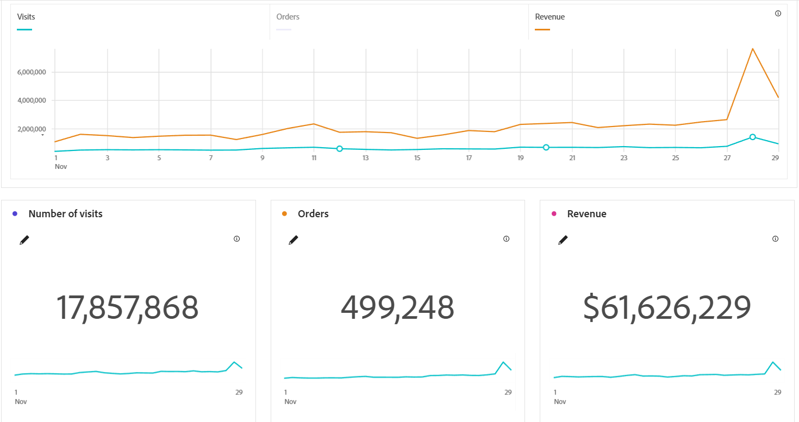

# API date-trended KPI basic report

The Analytics 2.0 Report API allows you to create, retrieve, or update basic and advanced date-trended KPI reports. You can use the example in this guide as a programattically-recurring report. It uses the same data and methods that are used in the UI. 

This guide provides instructions for a basic KPI report of *Visits*, *Orders*, and *Revenue* metrics for the *Day* dimension. For instructions on advanced KPI reports, see the Advanced Date-trended API Report Guide. 

<InlineAlert variant="info" slots="text" />

Adobe may add optional request and response members (name/value pairs) to existing API objects at any time and without notice or changes in versioning.

The report endpoint described in this guide is routed through analytics.adobe.io. To use it, you will need to first create a client with access to the Adobe Analytics Reporting API. For more information, refer to [Getting started with the Analytics API](https://developer.adobe.com/analytics-apis/docs/2.0/guides/).

## Report features

This guide shows an example for reporting key metrics over the past 30 days. You can use the requests and responses in this example to produce similar reports for the following purposes:

* Populating dashboards
* Exporting data to CSV files
* Feeding business-intelligence tools
* Connecting to cloud data warehouses
* Scheduling automated KPI updates 


### Example visualization

If constructed in Analysis Workspace, this basic KPI report might include the following free-form table:


And the following line graph and number summary visualizations of the same data:




For an API Report example that uses the page dimension and page metrics instead of date-trended data, see the [Reporting API overview](https://developer.adobe.com/analytics-apis/docs/2.0/guides/endpoints/reports/).

### Report APIs provide data, not visualizations

When you design reports via the Report API, you are creating the data foundation used by Analysis Workspace or another intelligence tool. API structures do not specify the presentation layers built on top of the data. You will not see a visualization parameter type in the JSON request or response.

## Request the date-trended data

To request the data:

1. Use the following URI for your POST HTTP call: POST https://analytics.adobe.io/api/{global-company-id}/reports. To find your Global Company ID, you can use the [Discovery API](https://developer.adobe.com/analytics-apis/docs/2.0/guides/endpoints/discovery/).
2. Use the example request JSON below as a template for requesting the data. Provide your desired date range in the request with any other modifications to the dimension or example key metrics.

Click the **Request** tab in the following example to see a POST request corresponding to the data shown in the visualizations above. Click the **Response** tab to see a successful JSON response for the request.


<CodeBlock slots="heading, code" repeat="2" languages="CURL,JSON"/>

### Example request

```sh
curl -X 'POST' \
  'https://analytics.adobe.io/api/{global-company-id}/reports' \
  -H 'accept: application/json' \
  -H 'Content-Type: application/json' \
  -H 'x-api-key: {API-key}' \
  -H 'Authorization: {Bearer-token}
  -d '{REQUESTJSON}
{
    "rsid": "examplersid",
    "globalFilters": [
        {
            "type": "dateRange",
            "dateRange": "2025-11-01T00:00:00.000/2025-12-01T00:00:00.000"
        }
    ],
    "metricContainer": {
        "metrics": [
            {
                "columnId": "0",
                "id": "metrics/visits"
            },
            {
                "columnId": "1",
                "id": "metrics/orders"
            },
            {
                "columnId": "2",
                "id": "metrics/revenue",
                "sort": "desc"
            }
        ]
    },
    "dimension": "variables/daterangeday",
    "settings": {
        "countRepeatInstances": true,
        "includeAnnotations": true,
        "nonesBehavior": "return-nones",
        "limit": 10,
        "page": 0
    },
    "statistics": {
        "functions": [
            "col-max",
            "col-min"
        ]
    },
    "capacityMetadata": {
        "associations": [
            {
                "name": "applicationName",
                "value": "Analysis Workspace UI"
            },
            {
                "name": "projectId",
                "value": "695da79bc917a51999999999"
            },
            {
                "name": "projectName",
                "value": "KPI by API"
            },
            {
                "name": "panelName",
                "value": "Freeform table"
            }
        ]
    }
}

```

## Example response

```json
{
    "totalPages": 3,
    "firstPage": true,
    "lastPage": false,
    "numberOfElements": 10,
    "number": 0,
    "totalElements": 30,
    "columns": {
        "dimensions": [
            {
                "id": "variables/daterangeday",
                "dimensionColumnId": "0fd6feb6-a35c-48ff-ad57-33c8d2a83606",
                "type": "time"
            }
        ],
        "columnIds": [
            "0",
            "1",
            "2"
        ],
        "dimension": {
            "id": "variables/daterangeday",
            "dimensionColumnId": "0fd6feb6-a35c-48ff-ad57-33c999999999",
            "type": "time"
        }
    },
    "rows": [
        {
            "data": [
                1401842,
                73535,
                7643632.88
            ],
            "itemId": "1251028",
            "value": "Nov 28, 2025"
        },
        {
            "data": [
                917334,
                40395,
                4180090.2800000003
            ],
            "itemId": "1251029",
            "value": "Nov 29, 2025"
        },
        {
            "data": [
                976312,
                38887,
                4030894.64
            ],
            "itemId": "1251030",
            "value": "Nov 30, 2025"
        },
        {
            "data": [
                743753,
                25640,
                2626938.6
            ],
            "itemId": "1251027",
            "value": "Nov 27, 2025"
        },
        {
            "data": [
                639525,
                21653,
                2459653.5300000003
            ],
            "itemId": "1251026",
            "value": "Nov 26, 2025"
        },
        {
            "data": [
                672602,
                20878,
                2423716.52
            ],
            "itemId": "1251021",
            "value": "Nov 21, 2025"
        },
        {
            "data": [
                667478,
                19093,
                2355620.19
            ],
            "itemId": "1251020",
            "value": "Nov 20, 2025"
        },
        {
            "data": [
                676125,
                15219,
                2325169.57
            ],
            "itemId": "1251011",
            "value": "Nov 11, 2025"
        },
        {
            "data": [
                647275,
                19366,
                2308749.96
            ],
            "itemId": "1251024",
            "value": "Nov 24, 2025"
        },
        {
            "data": [
                682171,
                18722,
                2288544.73
            ],
            "itemId": "1251019",
            "value": "Nov 19, 2025"
        }
    ],
    "summaryData": {
        "filteredTotals": [
            18832278,
            538135,
            65657124.02
        ],
        "annotations": [],
        "totals": [
            18832278,
            538135,
            65657124.02
        ],
        "annotationExceptions": [],
        "col-max": [
            1401842,
            73535,
            7643632.88
        ],
        "col-min": [
            385434,
            7788,
            1058036.96
        ]
    },
    "oberonAdditionalProperties": [
        {
            "lookupTime": 0.00246924,
            "totalReportTime": 6.863,
            "maxReportTime": 0.404759,
            "reportQueueTime": 0.000122,
            "capacityQueueTime": 0,
            "complexityScore": 0.33,
            "complexityMonthBoundaries": 3,
            "complexityColumns": 3,
            "complexityUniqueSegments": 0,
            "requestTime": 0.436879,
            "unhashTime": 0.000089671
        }
    ],
    "resultsRefreshDates": [
        "2025-12-01T19:38:07"
    ]
}
```

## Example request details

The JSON example provides a request for data of the top ten days of November 2025 in descending order, according to revenue. Note the following details:

* On or near lines 12-13, the `daterange` is specified as November 1, 2025 to December 1, 2025.
* On or near Lines 16-29, the metrics are specified as `visits`, `orders`, and `revenue` for columns `0`, `1`, and `2`, respectively.
* On or near line 29, a `sort` in descending order is specified for values in column `2` (revenue). This enables the ranking feature for the top days according to revenue.
* On or near line 33, the `dimension` is specified as `daterangeday`. 
* On or near line 38, a `limit` is specified for the response to `10` days.
* On or near lines 62-63, the metadata of `Freeform table` is asscociated with `panelName`.


### Request parameters

The example request includes the following parameters in the payload:

| Parameter | Req/Opt | Type | Description |
| --- | --- | -- | --|
| `rsid` | required | string | report suite ID |
| `globalFilters` | optional | array | Contains `type`, `dateRange`, and `dateRangeId` |
| `type` | optional | string | The type of filter applied |
| `dateRange` | optional | string | The date range of the data |
| `dateRangeId` | optional | string | The label for the date range; e.g., `ThisMonth` |
| `metricContainer` | optional | object | Contains `metrics` array|
| `metrics` | optional | array | Contains `ColumnId`, `id`, and `sort` |
| `columnId` | optional | string | The column number in the table visualization, left to right, starting from `0` |
| `id` | optional | string | The name of the element for the column; e.g., the name of the `metric` |
| `sort` | optional | string | The sorting applied to the column data--`asc` or `desc` |
| `dimension` | required | string | The dimension used for the report |
| `settings` | optional | object | The settings requested for the reporting response, as specified by the parameters in the following five rows |
| `countRepeatInstances` | optional | boolean | Whether to count repeat instances of a returned metric |
| `includeAnnotations` | optional | boolean | Whether to include annotations in the response |
| `limit` | optional | integer | The maximum number of items to return in the response |
| `page` | optional | integer | The maximum number of pages to return in the response |
| `nonesBehavior` | optional | string | Excludes instances with values of `0` if set to `exclude-nones` |
| `statistics` | optional | object | Contains the `functions` array |
| `functions` | optional | array | Contains `col-max` and `col-min` |
| `col-max` | optional | string | The column maximum |
| `col-min` | optional | string | The column minimum |
| `capacityMetadata` | optional | object | Contains `associations` array |
| `associations` | optional | array | Contains `name` and `value` parameters for each type of metadata associated with report; e.g., `applicationName`, `projectId`, `projectName`, and `panelName`|
| `name` | optional | string | The associated category type of the associated metadata |
| `value` | optional | string | The actual name or title specified for the metadata category in the report |

## Example response

Click on the **Response** tab above to see the entire response. It shows the data for the top ten ranked days according to revenue. Note the following for the first three days returned:

1. November 28, 2025 (occurring on "Black Friday") had `1401842` Visits, `73535` Orders, and `7643632.88` dollars for `Revenue`.
1. November 29, 2025 (occurring during "Black Friday" weekend) had `917334` Visits, `40395` Orders, and `4180090.28` dollars for `Revenue`.
1. November 30, 2025 (occurring during "Black Friday" weekend) had `976312` Visits, `38887` Orders, and `4030894.64` dollars for `Revenue`.

Although the metrics data is rounded in the visualizations, it matches the data in the examples above.

### Response parameters

The example response includes the following parameters:

| Parameter | Type | Description |
| --- | --- | -- |
| `totalPages` | integer | The total number of pages with data |
| `firstPage` | boolean | Whether to include the first page of results |
| `lastPage` | boolean | Whether to include the last page of results |
| `numberOfElements` | integer | The number of item elements in the report |
| `number` | integer | The number of pages, starting with `0` |
| `totalElements` | integer | Total number of elements in the report |
| `columns` | object | Contains column and `dimension` data |
| `dimension` | object | Contains `id` and `type` |
| `id` | string | Name of the dimension |
| `type` | string | The `dimension` ID data type |
| `columnIds` | string | The column number in the table visualization, left to right, starting from `0` |
| `rows` | container | Contains `itemId`, `value` and `data` |
| `itemId` | string | The item ID|
| `value` | string | The name specified for the `itemId` in the report |
| `data` | number($double) | The numerical values returned for the requested items |
| `summaryData` | object | Contains the **ranked** summary data information described in the following rows |
| `filteredTotals` | number($double) | The data totals after the specified filters are applied |
| `annotations` | string | Annotations for the summary data, if specified |
| `totals` | number($double) | The data totals |
| `annotationExceptions` | string | Exceptions for annotations |
| `col-max` | optional | The column maximum |
| `col-min` | optional | The column minimum |

## Partial Responses (206 Status Code)

A 206 status code indicates a partial response. This status code means that there were some columns in the reporting response that have errors. These errors can include any of the following:

* **Unauthorized Metric**: User does not have access to the requested metric
* **Metric Not Enabled**: The requested metric is not enabled in this report suite
* **Unauthorized Dimension**: User does not have access to the requested dimension
* **Dimension Not Enabled**: The requested dimension is not enabled in this report suite
* **Unauthorized Global Dimension**: User does not have access to the global dimension for this request
* **Global Dimension Not Enabled**: The global dimension for this request is not enabled in this report suite
* **Unexpected Number of Items**: Anomaly Detection algorithm returned an unexpected number of anomalies
* **General Service Error**: General Anomaly Detection service error
