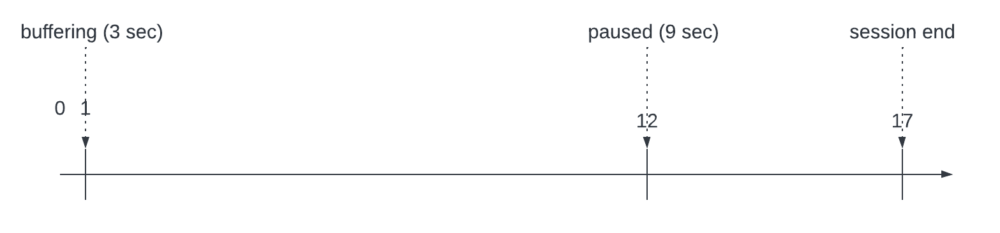
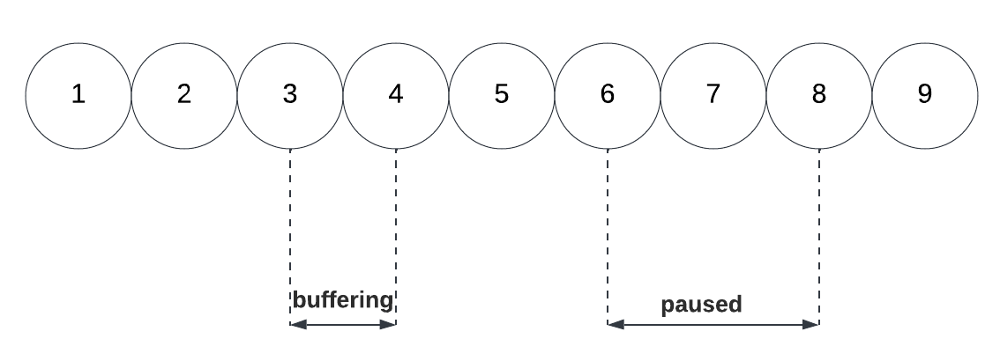

# Media Edge API use case: A buffer state and a pause

This guide provides a use case example of a media session tracked with the Media Edge API service. The example session shown for this use case contains the following elements:

* A `buffering` state.
* The user pressing `pause`.
* The user closing the app without finishing the content to the end.

Media Edge APIs are built on the Adobe Experience Platform to provide media event tracking data within the framework of [XDM schemas](https://experienceleague.adobe.com/docs/experience-platform/xdm/home.html#:~:text=Experience%20Data%20Model%20(XDM)%2C,the%20power%20of%20digital%20experiences). For more information, see the [Media Edge API overview](https://experienceleague.adobe.com/docs/experience-platform/edge-network-server-api/media-edge-apis/overview.html).

<InlineAlert variant="info" slots="text" />

Adobe may add optional request and response members (name/value pairs) to existing API objects at any time and without notice or changes in versioning. Adobe recommends that you refer to the API documentation of any third-party tool you integrate with our APIs so that such additions are ignored in processing if not understood. If implemented properly, such additions are non-breaking changes for your implementation. Adobe will not remove parameters or add required parameters without first providing standard notification through release notes.

## Use case introduction

For this session, you will need to make an API request for each action that you want to track. After [configuring a datastream](https://experienceleague.adobe.com/docs/experience-platform/datastreams/configure.html), you can begin tracking a session by providing the data stream ID in the following request:

POST `https://edge.adobedc.net/ee-pre-prd/va/v1/sessionStart?configId={dataStreamID}`

You can also specify session details as part of this request, including the name, length, content type, player name, channel, and app version.

### Example request to start tracking a session

The following example shows how to start tracking a session and specify session details in a request:

```cURL
curl -i --request POST '{uri}/ee/va/v1/sessionStart?configId={dataStreamId}' \
--header 'Content-Type: application/json' \
--data-raw '{
  "events": [
    {
      "xdm": {
        "eventType": "media.sessionStart",
        "timestamp": "YYYY-MM-DDT02:00:00.000Z",
        "mediaCollection": {
          "playhead": 0,
          "sessionDetails": {
            "name": "API Example Player",
            "length": 60,
            "contentType": "VOD",
            "playerName": "example-html5-api-player",
            "channel": "example-channel",
            "appVersion": "va-api-0.0.0"
          }
        }
      }
    }
  ]
}'
```

For more information regarding how to start the session, see the [Media Edge API getting started](https://experienceleague.adobe.com/docs/experience-platform/edge-network-server-api/media-edge-apis/getting-started.html?lang=en#:~:text=configId%3D%7Bdatastream%20ID%7D%20%5C-,Example,-request) guide.

Each subsequent request is made in the same manner, but with changes to the endpoint path and parameters as well as the payload to match the action.

## Playhead behavior during a buffer and a pause

The playhead position (the current position indicated in the horizontal timeline of the video) does not advance during buffering, pausing, or an ad break, even though real time has elapsed. Both playhead position and the passing of real time are measured in seconds.

The following actions and playhead diagrams show the differences in time during a buffer and a pause:

### Playhead diagram



### Actions diagram



Each number in the previous diagram (1-9) corresponds to an action and its request endpoint shown in the **Timeline summary table**, as well as to the **Detailed descriptions** below.

### Timeline summary table

The following table shows a timeline of actions to be tracked for this use case. Each row summarizes the action and the request endpoint. Each action is described in more detail with payloads below the table. The **Client Request** column shows the final path parameter and other parameters required to include in the call.

| # | Action | Elapsed Real-Time (from beginning) | Playhead Position | Client Request |
| --- | --- | --- | --- | --- |
| 1 | The auto-play function occurs, or the play button is pressed, and the video starts loading | 0 | 0 | `/sessionStart?configId=<datastreamID>` |
| 2 | The ping event timer starts | 0 | 0 | `/ping?configId=<datastreamID>` |
| 3 | Tracks the buffer start | 1 | 1 | `/bufferStart?configId=<datastreamID>` |
| 4 | Tracks the end of the buffer and a play event is sent | 4 | 1 | `/play?configId=<datastreamID>` |
| 5 | Sends a ping | 10 | 7 | `/ping?configId=<datastreamID>` |
| 6 | User presses `pause` | 15 | 12 | `/pauseStart?configId=<datastreamID>` |
| 7 | Sends a ping | 20 | 12 | `/ping?configId=<datastreamID>` |
| 8 | User presses `play` to resume the main content | 24 | 12 | `/play?configId=<datastreamID>` |
| 9 | User closes the app without watching the content to the end | 29 | 17 | `/sessionEnd?configId=<datastreamID>` |

<InlineAlert variant="info" slots="text" />

The events sent are ordered based on the timestamp at which they were sent. If they are sent at the same second, as illustrated in the examples below, they are still sent with different ascending timestamps.

<InlineAlert variant="info" slots="text" />

For media tracking, you must fire ping events every 10 seconds, tracked in real-time, beginning after 10 seconds have elapsed from the session start. This must happen regardless of other API events that you have sent. 

#### Detailed description of actions

The description of each action, together with the payload sent to Media Edge API are presented below.

#### 1. Start play

| # | Action | Elapsed Real-Time (from beginning) | Playhead Position | Client Request |
| --- | --- | --- | --- | --- |
| 1 | The auto-play function occurs, or play button is pressed, and the video starts loading | 0 | 0 | `/sessionStart?configId=<datastreamID>` |

This call signals the intention of the user to play a video. The player state is not yet `playing`, but is instead `starting`. This call returns a Session ID which is referenced in the following examples with `{SID}`. The `{SID}`, is returned to the client and is used to identify all subsequent tracking calls within the session.  This call also generates a reporting event that is pushed to AEP and/or Analytics, depending on datastream configuration. Mandatory parameters must be included.

**Example payload**

```json
{
 "eventType": "media.sessionStart",
  "timestamp": "YYYY-MM-DDT02:00:00.000Z",
  "mediaCollection": {
    "playhead": 0,
    "sessionDetails": {
      "name": "VA API Sample Player",
      "friendlyName": "ClickMe",
      "length": 60,
      "contentType": "VOD",
      "playerName": "sample-html5-api-player",
      "channel": "sample-channel",
      "appVersion": "va-api-0.0.0"
    }
  }
}
```

#### 2. [Ping event timer](https://experienceleague.adobe.com/docs/media-analytics/using/implementation/analytics-only/streaming-media-apis/mc-api-impl/mc-api-sed-pings.html)

| # | Action | Elapsed Real-Time (from beginning) | Playhead Position | Client Request |
| --- | --- | --- | --- | --- |
| 2 | The ping event timer starts | 0 | 0 | `/ping?configId=<datastreamID>` |

The application starts the ping timer. A call is not sent for this event, but the first ping call should be fired 10 seconds later.

#### 3. Track buffer start

| # | Action | Elapsed Real-Time (from beginning) | Playhead Position | Client Request |
| --- | --- | --- | --- | --- |
| 3 | Tracks the buffer start | 1 | 1 | `/bufferStart?configId=<datastreamID>` |

Player enters the `buffering` state. Because content is not being played the playhead is not advancing.

**Example payload**

```json
{
  "eventType": "media.bufferStart",
  "timestamp": "YYYY-MM-DDT02:00:01Z",
  "mediaCollection": {
    "sessionID": "{SID}",
    "playhead": 0
  }
}
```

#### 4. Track buffer end

| # | Action | Elapsed Real-Time (from beginning) | Playhead Position | Client Request |
| --- | --- | --- | --- | --- |
| 4 | Tracks the end of the buffer and a play event is sent | 4 | 1 | `/play?configId=<datastreamID>` |

Player buffering ends after 3 seconds so a `play` call is sent to put the player into the `playing` state. Sending a `play` call after the `bufferStart` call has been sent automatically ends the `buffering` state.

**Example payload**

```json
{
  "eventType": "media.play",
  "timestamp": "YYYY-MM-DDT02:00:04Z",
  "mediaCollection": {
    "sessionID": "{SID}",
    "playhead": 1
  }
}
```

#### 5. Ping

| # | Action | Elapsed Real-Time (from beginning) | Playhead Position | Client Request |
| --- | --- | --- | --- | --- |
| 5 | Sends a ping | 10 | 7 | `/ping?configId=<datastreamID>` |

A ping call is sent to the backend every 10 seconds.

**Example payload**

```json
{
  "eventType": "media.ping",
  "timestamp": "YYYY-MM-DDT02:00:10Z",
  "mediaCollection": {
    "sessionID": "{SID}",
    "playhead": 7
  }
}
```

#### 6. User pauses

| # | Action | Elapsed Real-Time (from beginning) | Playhead Position | Client Request |
| --- | --- | --- | --- | --- |
| 6 | User presses `pause` | 15 | 12 | `/pauseStart?configId=<datastreamID>` |

The user pauses the video. This moves the play state to `paused`.

**Example payload**

```json
{
  "eventType": "media.pauseStart",
  "timestamp": "YYYY-MM-DDT02:00:15Z",
  "mediaCollection": {
    "sessionID": "{SID}",
    "playhead": 12
  }
}
```

#### 7. Ping

| # | Action | Elapsed Real-Time (from beginning) | Playhead Position | Client Request |
| --- | --- | --- | --- | --- |
| 7 | Sends a ping | 20 | 12 | `/ping?configId=<datastreamID>` |

A ping call is sent to the backend every 10 seconds. The player remains in a `paused` state.

**Example payload**

```json
{
  "eventType": "media.ping",
  "timestamp": "YYYY-MM-DDT02:00:20Z",
  "mediaCollection": {
    "sessionID": "{SID}",
    "playhead": 12
  }
}
```

#### 8. User presses play

| # | Action | Elapsed Real-Time (from beginning) | Playhead Position | Client Request |
| --- | --- | --- | --- | --- |
| 8 | User presses `play` to resume the main content | 24 | 12 | `/play?configId=<datastreamID>` |

The user presses `play`. This moves the play state to `playing`. There is no need for a separate `resume` event.

**Example payload**

```json
{
  "eventType": "media.play",
  "timestamp": "YYYY-MM-DDT02:00:24Z",
  "mediaCollection": {
    "sessionID": "{SID}",
    "playhead": 12
  }
}
```

#### 9. User closes player

| # | Action | Elapsed Real-Time (from beginning) | Playhead Position | Client Request |
| --- | --- | --- | --- | --- |
| 9 | User closes the app without watching the content to the end | 29 | 17 | `/sessionEnd?configId=<datastreamID>` |

The user closes the app. `sessionEnd` is sent to the Media Edge API to signal that the session should be closed immediately, with no further processing.

**Example payload**

```json
{
  "eventType": "media.sessionEnd",
  "timestamp": "YYYY-MM-DDT02:00:29Z",
  "mediaCollection": {
    "sessionID": "{SID}",
    "playhead": 17
  }
}
```

## More help on this topic

* [Media Edge API overview](https://experienceleague.adobe.com/docs/experience-platform/edge-network-server-api/media-edge-apis/overview.html)
* [Media Edge API getting started](https://experienceleague.adobe.com/docs/experience-platform/edge-network-server-api/media-edge-apis/getting-started.html)
* [Media Edge Troubleshooting guide](https://experienceleague.adobe.com/docs/experience-platform/edge-network-server-api/media-edge-apis/troubleshooting.html)
