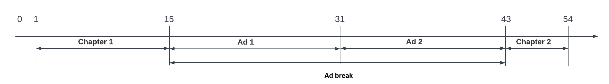
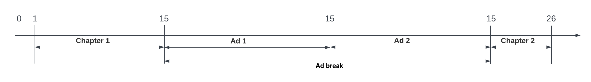
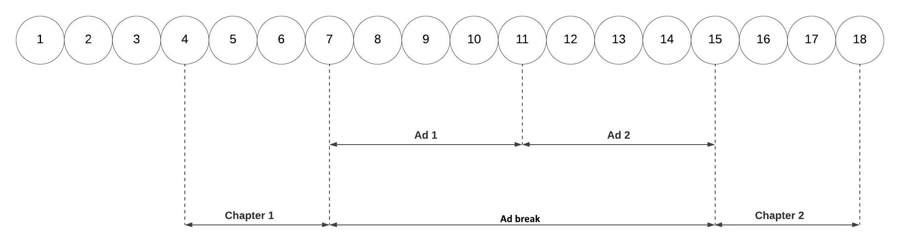

# Media Edge API use case: Two chapters separated by an ad break

This guide provides a use case for tracking a media session with the Media Edge API service. The example session shown for this use case contains the following elements:

* Two chapters: `Chapter 1` and `Chapter 2`.
* An ad break inserted at the middle of the content that contains two ads: `Ad 1` and `Ad 2`.

Media Edge APIs are built on the Adobe Experience Platform to provide media event tracking data within the framework of [XDM schemas](https://experienceleague.adobe.com/docs/experience-platform/xdm/home.html#:~:text=Experience%20Data%20Model%20(XDM)%2C,the%20power%20of%20digital%20experiences). For more information, see the [Media Edge API overview](https://experienceleague.adobe.com/docs/experience-platform/edge-network-server-api/media-edge-apis/overview.html).

<InlineAlert variant="info" slots="text" />

Adobe may add optional request and response members (name/value pairs) to existing API objects at any time and without notice or changes in versioning. Adobe recommends that you refer to the API documentation of any third-party tool you integrate with our APIs so that such additions are ignored in processing if not understood. If implemented properly, such additions are non-breaking changes for your implementation. Adobe will not remove parameters or add required parameters without first providing standard notification through release notes.

## Use case introduction

For this session, you will need to make an API request for each action that you want to track. After [configuring a datastream](https://experienceleague.adobe.com/docs/experience-platform/datastreams/configure.html), you can begin tracking a session by providing the data stream ID in the following request:

POST `https://edge.adobedc.net/ee-pre-prd/va/v1/sessionStart?configId={dataStreamID}`

You can also specify session details as part of this request, including the name, length, content type, player name, channel, and app version.

### Example request to start tracking a session

The following example request shows how to start tracking a session and how to specify session details in a request:

```curl
curl -i --request POST '{uri}/ee/va/v1/sessionStart?configId={dataStreamId}' \
--header 'Content-Type: application/json' \
--data-raw '{
  "events": [
    {
      "xdm": {
        "eventType": "media.sessionStart",
        "timestamp": "YYYY-MM-DDT02:00:00.000Z",
        "mediaCollection": {
          "playhead": 0,
          "sessionDetails": {
            "name": "API Example Player",
            "length": 60,
            "contentType": "VOD",
            "playerName": "example-html5-api-player",
            "channel": "example-channel",
            "appVersion": "va-api-0.0.0"
          }
        }
      }
    }
  ]
}'
```

For more information regarding how to start the session, see the [Media Edge API getting started](https://experienceleague.adobe.com/docs/experience-platform/edge-network-server-api/media-edge-apis/getting-started.html?lang=en#:~:text=configId%3D%7Bdatastream%20ID%7D%20%5C-,Example,-request) guide.

Each subsequent request is made in the same manner, but with changes to the endpoint path, parameters, and request payload to match the action.

### Playhead behavior during an ad break

<InlineAlert variant="info" slots="text" />

The playhead position (the current position indicated in the horizontal timeline of the video) does not advance during an ad break, buffering, or pausing, even though real time has elapsed. Both **playhead position** and the passing of real time are measured in seconds.

The following action and playhead diagrams show the differences in time during an ad break.

#### Action diagram



#### Playhead diagram



## Timeline of actions

The following diagram shows a timeline of actions for this example session. Each number (1-18) represents an action and its request endpoint. These numbers also correspond to event descriptions in both the **Timeline summary table** and the **Detailed descriptions** section below.



### Timeline summary table

The Client request column in the table below shows the final path parameter and the other parameters required to include in the call. 

| # | Action | Elapsed Real-Time (from beginning in seconds) | Playhead Position (in seconds)| Client request |
| --- | --- | --- | --- | --- |
| 1 | The auto-play function occurs, or the Play button is pressed, and the video starts loading. | 0 | 0 | `/sessionStart?configId=<datastreamID>` |
| 2 | The [ping event timer](https://experienceleague.adobe.com/docs/media-analytics/using/implementation/analytics-only/streaming-media-apis/mc-api-impl/mc-api-sed-pings.html) starts | 0 | 0 | `/ping?configId=<datastreamID>` |
| 3 | Tracks the `play` event | 0 | 0 | `/play?configId=<datastreamID>` |
| 4 | Tracks the start of `Chapter 1` | 1 | 1 | `/chapterStart?configId=<datastreamID>` |
| 5 | Sends a ping | 10 | 10 | `/ping?configId=<datastreamID>` |
| 6 | Tracks the completion of `Chapter 1` | 15 | 15 | `/chapterComplete?configId=<datastreamID>` |
| 7 | Tracks the start of ad break | 15 | 15 | `/adBreakStart?configId=<datastreamID>` |
| 8 | Tracks the start of `Ad 1` in ad break | 15 | 15 | `/adStart?configId=<datastreamID>` |
| 9 | Sends a ping twice during `Ad 1`, each 10 seconds apart | 20, 30 | 15, 15 | `/ping?configId=<datastreamID>` |
| 10 | Tracks completion of `Ad 1` | 31 | 15 | `/adComplete?configId=<datastreamID>` |
| 11 | Tracks the start of `Ad 2` in ad break | 31 | 15 | `/adStart?configId=<datastreamID>` |
| 12 | Sends ping | 40 | 15 | `/ping?configId=<datastreamID>` |
| 13 | Tracks completion of `Ad 2` | 43 | 15 | `/adComplete?configId=<datastreamID>` |
| 14 | Tracks completion of ad break | 43 | 15 | `/adBreakComplete?configId=<datastreamID>` |
| 15 | Tracks the start of `Chapter 2` | 43 | 15 | `/chapterStart?configId=<datastreamID>` |
| 16 | Sends ping | 50 | 22 | `/ping?configId=<datastreamID>` |
| 17 | Tracks completion of `Chapter 2`| 54 | 26 | `/chapterComplete?configId=<datastreamID>` |
| 18 | Tracks completion of session when user finishes watching the content to the end | 55 | 26 | `/sessionComplete?configId=<datastreamID>` |

<InlineAlert variant="info" slots="text" />

The events sent are ordered based on the timestamp at which they were sent. If they are sent at the same second, as illustrated in the examples below, they are still sent with different ascending timestamps.

<InlineAlert variant="info" slots="text" />

For media tracking, you must fire ping events every 10 seconds, tracked in real-time, beginning after 10 seconds have elapsed from the session start. This must happen regardless of other API events that you have sent. 

### Detailed description of actions

Each timeline action shown in the previous table is described in detail below. Each description includes the payload that is sent as part of a Media Edge API request.

#### 1. Session start

| # | Action | Elapsed Real-Time (from beginning) | Playhead Position | Client request |
| --- | --- | --- | --- | --- |
| 1 | The auto-play function occurs or Play button is pressed and the video starts loading | 0 | 0 | `/sessionStart?configId=<datastreamID>` |

This call signals the intent of the user to play a video and returns a Session ID {SID} to the client. The {SID} is used to identify all subsequent tracking calls within the session.  This call also generates a reporting event that is pushed to either Adobe Experience Platform, or Adobe Analytics, or both, depending on your datastream configuration. This action represents the start of the process but not yet in the *playing* state. Required parameters must be included, as shown in [endpoint reference](https://experienceleague.adobe.com/docs/experience-platform/edge-network-server-api/media-edge-apis/swagger.html).

**Example payload**

```json
{
  "eventType": "media.sessionStart",
  "timestamp": "YYYY-MM-DD`T02:00:00.000Z",
  "mediaCollection": {
    "playhead": 0,
    "sessionDetails": {
      "name": "VA API Sample Player",
      "friendlyName": "ClickMe",
      "length": 54,
      "contentType": "VOD",
      "playerName": "sample-html5-api-player",
      "channel": "sample-channel",
      "appVersion": "va-api-0.0.0"
    }
  }
}
```
#### 2. [Ping timer starts](https://experienceleague.adobe.com/docs/media-analytics/using/implementation/analytics-only/streaming-media-apis/mc-api-impl/mc-api-sed-pings.html)

| # | Action | Elapsed Real-Time (from beginning) | Playhead Position | Client request |
| --- | --- | --- | --- | --- |
| 2 | The ping event timer starts | 0 | 0 | `/ping?configId=<datastreamID>` |

The application starts the ping timer. A call is not sent for this event, but the first ping call should be fired 10 seconds later.

#### 3. Track play

| # | Action | Elapsed Real-Time (from beginning) | Playhead Position | Client request |
| --- | --- | --- | --- | --- |
| 3 | Tracks the `play` event | 0 | 0 | `/play?configId=<datastreamID>` |

Tracking enters the *playing* state using the `play` event.

**Example payload**

```json
{
  "eventType": "media.play",
  "timestamp": "YYYY-0MM-DDT02:00:00Z",
  "mediaCollection": {
    "sessionID": "{SID}",
    "playhead": 0
  }
}
```

#### 4. Track Chapter 1 start

| # | Action | Elapsed Real-Time (from beginning) | Playhead Position | Client request |
| --- | --- | --- | --- | --- |
| 4 | Tracks the start of `Chapter 1` | 1 | 1 | `/chapterStart?configId=<datastreamID>` |

Tracks the start `Chapter 1`.

**Example payload**

```json
{
  "eventType": "media.chapterStart",
  "timestamp": "YYYY-MM-DDT02:00:01Z",
  "mediaCollection": {
    "sessionID": "{SID}",
    "playhead": 1,
    "chapterDetails": {
      "index": 1,
      "offset": 0,
      "friendlyName": "Chapter one",
      "length": 15
    }
  }
}
```

#### 5. Ping

| # | Action | Elapsed Real-Time (from beginning) | Playhead Position | Client request |
| --- | --- | --- | --- | --- |
| 5 | Sends a ping | 10 | 10 | `/ping?configId=<datastreamID>` |

A ping call is sent to the back-end every 10 seconds.

**Example payload**

```json
{
  "eventType": "media.ping",
  "timestamp": "YYYY-MM-DDT02:00:10Z",
  "mediaCollection": {
    "sessionID": "{SID}",
    "playhead": 10
  }
}
```

#### 6. Track Chapter 1 completion

| # | Action | Elapsed Real-Time (from beginning) | Playhead Position | Client request |
| --- | --- | --- | --- | --- |
| 6 | Tracks the completion of `Chapter 1` | 15 | 15 | `/chapterComplete?configId=<datastreamID>` |

`Chapter 1` ends directly before the ad break. On the backend, this call also generates a reporting event that is pushed to either Adobe Experience Platform, or Adobe Analytics, or both, depending on the datastream configuration.

**Example payload**

```json
{
  "eventType": "media.chapterComplete",
  "timestamp": "YYYY-MM-DDT02:00:15Z",
  "mediaCollection": {
    "sessionID": "{SID}",
    "playhead": 15
  }
}
```

#### 7. Ad break start

| # | Action | Elapsed Real-Time (from beginning) | Playhead Position | Client request |
| --- | --- | --- | --- | --- |
| 7 | Tracks the start of ad break | 15 | 15 | `/adBreakStart?configId=<datastreamID>` |

Ad break starts. It will contain two ads.

**Example payload**

```json
{
  "eventType": "media.adBreakStart",
  "timestamp": "YYYY-MM-DDT02:00:16Z",
  "mediaCollection": {
    "sessionID": "{SID}",
    "playhead": 15,
    "advertisingPodDetails": {
      "index": 0,
      "offset": 15,
      "friendlyName": "Mid-roll break"
    }
  }
}
```

#### 8. Track Ad 1 start

| # | Action | Elapsed Real-Time (from beginning) | Playhead Position | Client request |
| --- | --- | --- | --- | --- |
| 8 | Tracks the start of `Ad 1` in ad break | 15 | 15 | `/adStart?configId=<datastreamID>` |

`Ad 1` begins to play. On the backend, this call also generates a reporting event that is pushed to either Adobe Experience Platform, or Adobe Analytics, or both, depending on the datastream configuration.

**Example payload**

```json
{
  "eventType": "media.adStart",
  "timestamp": "YYYY-MM-DDT02:00:16Z",
  "mediaCollection": {
    "sessionID": "{SID}",
    "playhead": 15,
    "advertisingDetails": {
      "name": "001",
      "advertiser": "Ad Guys",
      "campaignID": "1",
      "creativeID": "42",
      "creativeURL": "https://example.com",
      "length": 16,
      "friendlyName": "Ad 1",
      "placementID": "sample_placement",
      "playerName": "Sample Player",
      "podPosition": 1,
      "siteID": "XYZ"
    },
    "customMetadata": [
      {
        "name": "myCustomData1",
        "value": "CustomData1"
      },
      {
        "name": "myCustomData2",
        "value": "CustomData2"
      }
    ]
  }
}
```

#### 9. Pings

| # | Action | Elapsed Real-Time (from beginning) | Playhead Position | Client request |
| --- | --- | --- | --- | --- |
| 9 | Sends a ping twice during `Ad 1`, each 10 seconds apart | 20,30 | 15,15 | `/ping?configId=<datastreamID>` |

A ping call is sent to the back-end every 10 seconds. In this particular case, two separate events are sent at the timestamps 20 and 30, respectively.

**Example payload**

```json
{
  "eventType": "media.ping",
  "timestamp": "YYYY-MM-DDT02:00:20Z",
  "mediaCollection": {
    "sessionID": "{SID}",
    "playhead": 15
  }
}
```

```json
{
  "eventType": "media.ping",
  "timestamp": "YYYY-MM-DDT02:00:30Z",
  "mediaCollection": {
    "sessionID": "{SID}",
    "playhead": 15
  }
}
```

#### 10. Track ad 1 completion

| # | Action | Elapsed Real-Time (from beginning) | Playhead Position | Client request |
| --- | --- | --- | --- | --- |
| 10 | Tracks completion of `Ad 1` | 31 | 15 | `/adComplete?configId=<datastreamID>` |

The completion of `Ad 1` is tracked. On the backend, this call also generates a reporting event that is pushed to either Adobe Experience Platform, or Adobe Analytics, or both, depending on the datastream configuration.

**Example payload**

```json
{
  "eventType": "media.adComplete",
  "timestamp": "YYYY-MM-DDT02:00:31Z",
  "mediaCollection": {
    "sessionID": "{SID}",
    "playhead": 15
  }
}
```

#### 11. Track ad 2 start

| # | Action | Elapsed Real-Time (from beginning) | Playhead Position | Client request |
| --- | --- | --- | --- | --- |
| 11 | Tracks the start of `Ad 2` in ad break | 31 | 15 | `/adStart?configId=<datastreamID>` |

`Ad 2` begins to play. On the backend, this call also generates a reporting event that is pushed to either Adobe Experience Platform, or Adobe Analytics, or both, depending on the datastream configuration.

**Example payload**

```json
{
  "eventType": "media.adStart",
  "timestamp": "YYYY-MM-DDT02:00:31Z",
  "mediaCollection": {
    "playhead": 0,
    "sessionID": "{SID}",
    "advertisingDetails": {
      "name": "002",
      "advertiser": "Ad Guys",
      "campaignID": "2",
      "creativeID": "44",
      "creativeURL": "https://example.com",
      "length": 12,
      "friendlyName": "Ad 2",
      "placementID": "sample_placement2",
      "playerName": "Sample Player",
      "podPosition": 1,
      "siteID": "XYZ"
    }
  }
}
```

#### 12. Ping

| # | Action | Elapsed Real-Time (from beginning) | Playhead Position | Client request |
| --- | --- | --- | --- | --- |
| 12 | Sends ping | 40 | 15 | `/ping?configId=<datastreamID>` |

A ping call is sent to the backend every 10 seconds. In this scenario, at timelines 20 and 30 seconds.

**Example payload**

```json
{
  "eventType": "media.ping",
  "timestamp": "YYYY-MM-DDT02:00:40Z",
  "mediaCollection": {
    "sessionID": "{SID}",
    "playhead": 15
  }
}
```

#### 13. Track ad 2 completion

| # | Action | Elapsed Real-Time (from beginning) | Playhead Position | Client request |
| --- | --- | --- | --- | --- |
| 13 | Tracks completion of `Ad 2` | 43 | 15 | `/adComplete?configId=<datastreamID>` |

The completion of `Ad 2` is tracked. On the backend, this call also generates a reporting event that is pushed to either Adobe Experience Platform, or Adobe Analytics, or both, depending on the datastream configuration.

**Example payload**

```json
{
  "eventType": "media.adComplete",
  "timestamp": "YYYY-MM-DDT02:00:43Z",
  "mediaCollection": {
    "sessionID": "{SID}",
    "playhead": 15
  }
}
```

#### 14. Ad break completion

| # | Action | Elapsed Real-Time (from beginning) | Playhead Position | Client request |
| --- | --- | --- | --- | --- |
| 14 | Tracks completion of ad break | 43 | 43 | `/adBreakComplete?configId=<datastreamID>` |

The completion of the ad break is tracked.

**Example payload**

```json
{
  "eventType": "media.adBreakComplete",
  "timestamp": "YYYY-MM-DDT02:00:43Z",
  "mediaCollection": {
    "sessionID": "{SID}",
    "playhead": 15
  }
}
```

#### 15. Track Chapter 2 start

| # | Action | Elapsed Real-Time (from beginning) | Playhead Position | Client request |
| --- | --- | --- | --- | --- |
| 15 | Tracks the start of `Chapter 2` | 43 | 15 | `/chapterStart?configId=<datastreamID>` |

The start of `Chapter 2` is tracked directly after the completion of the ad break.

**Example payload**

```json
{
  "eventType": "media.chapterStart",
  "timestamp": "YYYY-MM-DDT02:00:44Z",
  "mediaCollection": {
    "sessionID": "{SID}",
    "playhead": 15,
    "chapterDetails": {
      "index": 2,
      "offset": 43,
      "friendlyName": "Chapter two",
      "length": 11
    }
  }
}
```

#### 16. Ping

| # | Action | Elapsed Real-Time (from beginning) | Playhead Position | Client request |
| --- | --- | --- | --- | --- |
| 16 | Sends ping | 50 | 22 | `/ping?configId=<datastreamID>` |

A ping call is sent to the backend every 10 seconds.

**Example payload**

```json
{
  "eventType": "media.ping",
  "timestamp": "YYYY-MM-DDT02:00:50Z",
  "mediaCollection": {
    "sessionID": "{SID}",
    "playhead": 22
  }
}
```

#### 17. Track Chapter 2 completion

| # | Action | Elapsed Real-Time (from beginning) | Playhead Position | Client request |
| --- | --- | --- | --- | --- |
| 17 | Tracks completion of `Chapter 2`| 54 | 26 | `/chapterComplete?configId=<datastreamID>` |

The completion of `Chapter 2` is tracked.

**Example payload**

```json
{
  "eventType": "media.chapterComplete",
  "timestamp": "YYYY-MM-DDT02:00:54Z",
  "mediaCollection": {
    "sessionID": "{SID}",
    "playhead": 26
  }
}
```

#### 18. Session complete

| # | Action | Elapsed Real-Time (from beginning) | Playhead Position | Client request |
| --- | --- | --- | --- | --- |
| 18 | Tracks completion of session when user finishes watching the content to the end | 54 | 26 | `/sessionComplete?configId=<datastreamID>` |

`sessionComplete` is sent to the backend to indicate that the user finished watching the entire content. On the backend, this call also generates a reporting event that is pushed to either Adobe Experience Platform, or Adobe Analytics, or both, depending on the datastream configuration.

**Example payload**

```json
{
  "eventType": "media.sessionComplete",
  "timestamp": "YYYY-MM-DDT02:00:55Z",
  "mediaCollection": {
    "sessionID": "{SID}",
    "playhead": 26
  }
}
```

## More help on this topic

* [Media Edge API overview](https://experienceleague.adobe.com/docs/experience-platform/edge-network-server-api/media-edge-apis/overview.html)
* [Media Edge API getting started](https://experienceleague.adobe.com/docs/experience-platform/edge-network-server-api/media-edge-apis/getting-started.html)
* [Media Edge Troubleshooting guide](https://experienceleague.adobe.com/docs/experience-platform/edge-network-server-api/media-edge-apis/troubleshooting.html)
