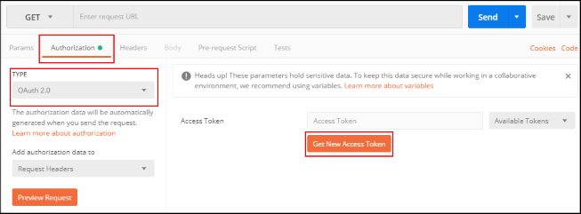
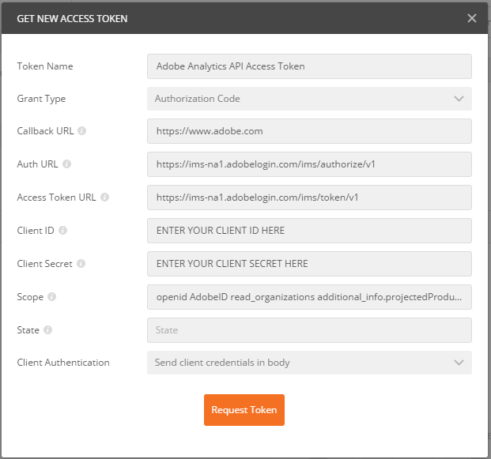
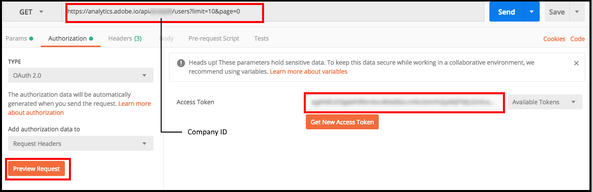
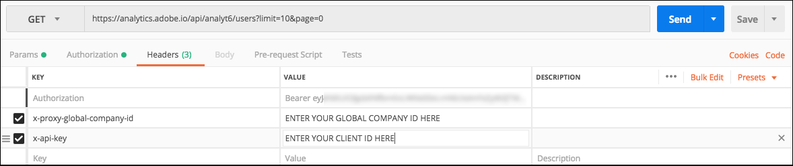

# OAuth in POSTMAN

## What's Needed

For OAuth authentication in Postman, you will need the following:

* The **Client ID**, **Client Secret**, and **Default Redirect URI** from your integration on the Adobe I/O console.
* Your **Global Company ID**. 

## Configure the Request

### Video tutorials:
You can also refer to the video tutorials:

* [Using Postman to Make Adobe Analytics 2.0 API Requests](https://www.youtube.com/watch?v=lrg1MuVi0Fo)
* [Using Analysis Workspace to Build Adobe Analytics API 2.0 Requests](https://www.youtube.com/watch?v=j1kI3peSXhY)

### To configure the OAuth authentication request:

1.  Click the **Authorization** tab on the Request screen.
1.  In the **TYPE** dropdown, select **OAuth 2.0**.
1.  Click the **Get New Access Token** button.

    

1.  On the **GET NEW ACCESS TOKEN** form, provide the following values:

    | Parameter             | Value       |
    |-------------------------|-----------|
    | Token Name            | Specify a name  |
    | Grant Type            | Select **Authorization Code** from the dropdown |
    | Callback URL          | Enter your OAuth client default redirect URI |
    | Auth URL              | <https://ims-na1.adobelogin.com/ims/authorize/v1> |
    | Access Token URL      | <https://ims-na1.adobelogin.com/ims/token/v1> |
    | Client ID             | Enter your Client ID from Adobe I/O |
    | Client Secret         | Enter your Client Secret from Adobe I/O |
    | Scope                 | Enter `openid,AdobeID,read_organizations,additional_info.projectedProductContext,additional_info.job_function` |
    | Client Authentication | Select **Send client credentials in body** from the dropdown |

    

1.  Click **Request Token**. You will be prompted to login. Click the **Use Token** button at the bottom of the resulting pop up screen. The token automatically populates the **Available Token** field.

1. Enter the request URI path you want to call, including your Global Company ID as shown below, and then click the **Preview Request** button. This updates the request header with the token value.

    

    *If you have already requested other tokens in Postman, you can select them from the **Available Tokens** dropdown.*

1. Specify the method from the Postman request dropdown. Click the **Headers** tab. In the Postman Headers table, the **Authorization** KEY contains a corresponding **Bearer** token VALUE.

1. On the next row, add the header KEY `x-proxy-global-company-id` and enter you Global Company ID as the VALUE.

1. On the next row, add the header KEY `x-api-key` and enter your Client ID as the value.

    

1. Click the **Send** button. The `GET`/users response includes the first 10 users for your Analytics company. You are now also authorized to work with other Analytics endpoints.
