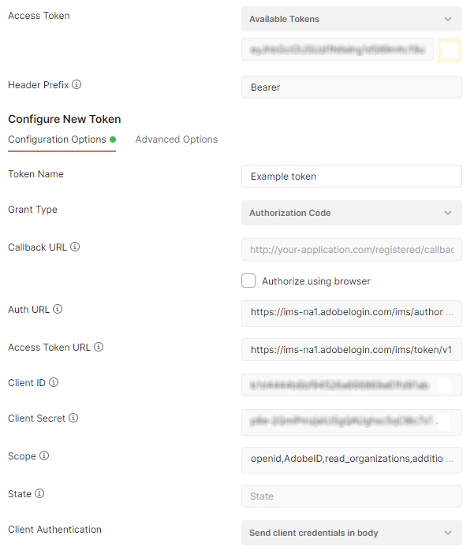

# Use Postman with the Adobe Analytics 2.0 API

[Postman](https://www.postman.com/) is a widely used API client that allows you to easily send API requests using a graphical interface. It provides a convenient environment to interact with the Adobe Analytics 2.0 API.

## Prerequisites

* Follow the instructions listed under [Getting Started](../../index.md). This step includes developer permissions, creating an API client, and choosing `OAuth` as the authentication method. You can set the **Redirect URI** and **Redirect URI pattern** to any value; Postman does not use it for authentication.
* Download and install [Postman](https://www.postman.com/downloads/).

## Configure Postman for authentication

You must first configure Postman to authenticate with your Adobe ID. Once you authenticate, Postman generates a token that you can include in API calls.

1. In a new request tab, click the **Authorization** section.
1. Under the **Type** dropdown, select **OAuth 2.0**. Several configuration options appear to the right.
1. Use the following configuration options:

    Option | Value
    --- | ---
    Access Token | A dropdown that lets you select from previously configured tokens. If you are following these steps for the first time, this dropdown is empty. If you already have a token configured, you can select the desired token, which populates all of the below fields for you.
    Header Prefix | `Bearer`
    Token name | Any value that you'd like
    Grant Type | `Authorization Code`
    Callback URL | (Optional) The **Redirect URI** in the Adobe Developer Console
    Authorize using browser | Unchecked
    Auth URL | `https://ims-na1.adobelogin.com/ims/authorize/v1`
    Access Token URL | `https://ims-na1.adobelogin.com/ims/token/v1`
    Client ID | The **Client ID** in the Adobe Developer Console
    Client Secret | The **Client Secret** in the Adobe Developer Console
    Scope | `openid AdobeID read_organizations additional_info.projectedProductContext additional_info.job_function`
    State | Can be left blank
    Client Authentication | `Send client credentials in body`

    

1. Click **Get New Access Token**. A popup appears requesting your AdobeID credentials.
1. Authenticate using the popup. Make sure that you log in to the same IMS org that you created the API client in the Adobe Developer Console.
1. Once authenticated, the popup closes and a modal window appears with your access token.
1. Click the **Use Token** button.

The token is now configured, and you can use it in any API requests from Postman. When the token expires (typically after 24 hours), you can navigate back to the Authorization section and click **Get New Access Token**. Once you authenticate using your Adobe ID, a new access token is generated.

To refresh authentication tokens, see the [Authentication Guide.](https://developer.adobe.com/developer-console/docs/guides/authentication/UserAuthentication/IMS/#refreshing-access-tokens)


## Obtain a global company ID

Most endpoints require a `globalCompanyId` value in the request URL. You can use the Discovery API to obtain this value.

1. Set the request URL to `https://analytics.adobe.io/discovery/me`. Make sure that the request type is `GET`.
1. Make sure that the **Authorization** section is set to use the desired token.
1. Click the **Headers** section and add the following key/value pair:
    * Key: `x-api-key`
    * Value: the **Client ID** in the Adobe Developer Console
1. Click **Send**. The API responds with a JSON object containing information around your user ID, including a `globalCompanyId`.

```json
{
    "imsUserId": "B6A778CE...CE48E0A485E74@aed3014d62d...5d485fed.e",
    "imsOrgs": [
        {
            "imsOrgId": "52A16ACB5...D3769A495C99@AdobeOrg",
            "companies": [
                {
                    "globalCompanyId": "exampleco",
                    "companyName": "Example Company",
                    "apiRateLimitPolicy": "aa_api_tier10_tp",
                    "dpc": "pnw"
                }
            ]
        }
    ]
}
```

You now have everything needed to make requests to the Adobe Analytics 2.0 API in Postman.

## Send a basic GET request

Use the API to retrieve a list of Workspace projects that the user created.

1. Set the request URL to `https://analytics.adobe.io/api/{GLOBALCOMPANYID}/projects`. Make sure that you replace part of the endpoint URL with your organization's global company ID, and that the request type is `GET`.
1. Make sure that the **Authorization** section is set to use the desired token.
1. Make sure that the **Headers** section contains the `x-api-key` key, and that the value is set to the **Client ID** in the Adobe Developer Console.
1. Click **Send**. The API responds with a JSON object containing Analysis Workspace projects that you created.

```json
[
    {
        "id": "639a2325a2...66870efce6a",
        "name": "Example Workspace project",
        "description": "",
        "rsid": "examplersid",
        "type": "project",
        "owner": {
            "id": 123456789
        },
        "created": "YYYY-12-14T19:25:25Z"
    }
]
```

## Send a basic POST request

Use the API to create a basic calculated metric. The calculated metric definition is contained within the request's body.

1. Set the request URL to `https://analytics.adobe.io/api/{GLOBALCOMPANYID}/calculatedmetrics`. Make sure that you replace part of the endpoint URL with your organization's global company ID.
1. Set the request type to `POST`.
1. Make sure that the **Authorization** section is set to use the desired token.
1. Make sure that the **Headers** section contains the `x-api-key` key, and that the value is set to the **Client ID** in the Adobe Developer Console.
1. Go to the **Body** section, set the radio button to **Raw**, and set the dropdown next to it to **JSON**.
1. Paste the following JSON object in the Body field. It is a basic calculated metric that returns `Pages views + 1`. Make sure that you replace the `rsid` field with a report suite in your organization.

    ```json
    {
        "rsid": "examplersid",
        "name": "Example calculated metric",
        "definition": {
            "formula": {
                "func": "add",
                "col1": {
                    "func": "metric",
                    "name": "metrics/pageviews",
                    "description": "Page Views"
                },
                "col2": 1
            },
            "func": "calc-metric",
            "version": [
                1,
                0,
                0
            ]
        }
    }
    ```

1. The API returns a JSON object containing details around the created calculated metric, including the `id` that you can reference in other API calls.
1. Log in to [Adobe Analytics](https://experience.adobe.com) and navigate to **Components** > **Calculated metrics**. Note that you can see the calculated metric that you created through the API.
1. You can delete the calculated metric through the Analytics UI, or you can delete it using the API call `DELETE https://analytics.adobe.io/api/{GLOBALCOMPANYID}/calculatedmetrics/{ID}`.

## Additional learning

The following video tutorials provide additional information authenticating and sending API calls:

* [Using Postman to Make Adobe Analytics 2.0 API Requests](https://www.youtube.com/watch?v=lrg1MuVi0Fo)
* [Using Analysis Workspace to Build Adobe Analytics API 2.0 Requests](https://www.youtube.com/watch?v=j1kI3peSXhY)
